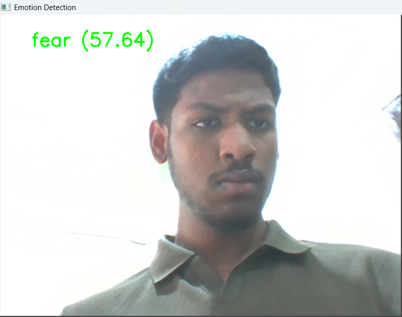
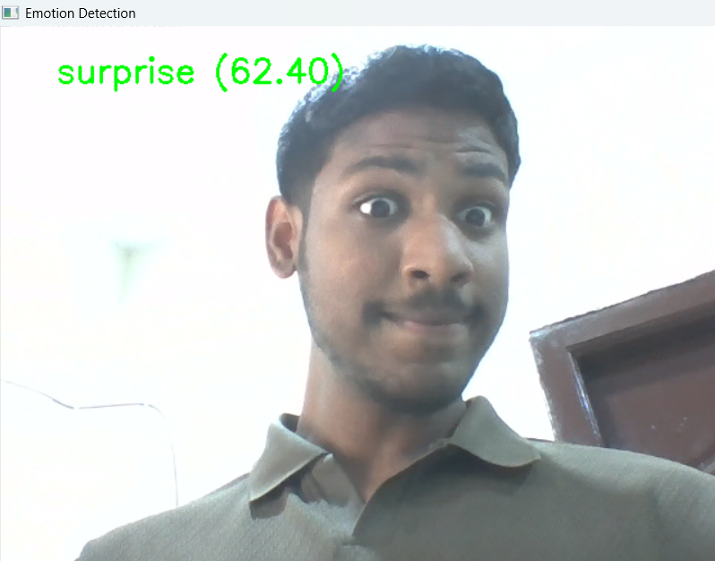

# Vision Proctor: AI Facial Behavior Detection

## Overview

Vision Proctor is a real-time facial emotion detection system developed using Python, OpenCV, and DeepFace.

The application captures live webcam input, analyzes facial expressions, identifies the dominant emotion, and stores the detected emotions in a CSV log file for later analysis.

---

## Features

- Real-time webcam emotion detection
- Emotion classification using DeepFace
- Live emotion confidence score display
- Automatic CSV log generation
- Simple and lightweight implementation

---

## Technology Stack

- Python
- OpenCV
- DeepFace
- Pandas
- TensorFlow
- NumPy

---

## Project Screenshots

### Neutral Emotion


### Happy Emotion


### Fear Emotion


### Surprise Emotion


---

## Demo Video

A complete demonstration of the system is included in this repository.

➡️ Download: [demo.mp4](demo.mp4)
---

## Project Report

[📄 Project Report](project_report.pdf)

---

## Sample Output Log

A sample generated log is available here:

[📊 Sample Emotion Log](logs/sample_emotion_log.csv)

---

## Installation

Clone the repository:

```bash
git clone https://github.com/lsaketh123/Vision-Proctor-AI-Facial-Behavior-Detection.git
```

Install dependencies:

```bash
pip install -r requirements.txt
```

Run the project:

```bash
python emotion_realtime.py
```

Press `q` to stop the application and save the log file.

---

## Future Enhancements

- Eye tracking
- Head pose estimation
- Suspicious activity detection
- Online examination monitoring
- Web-based dashboard

---

## Author

**Saketh Lagishetty**

AI/ML Enthusiast | Full Stack Developer | Cybersecurity Learner

GitHub: https://github.com/lsaketh123
